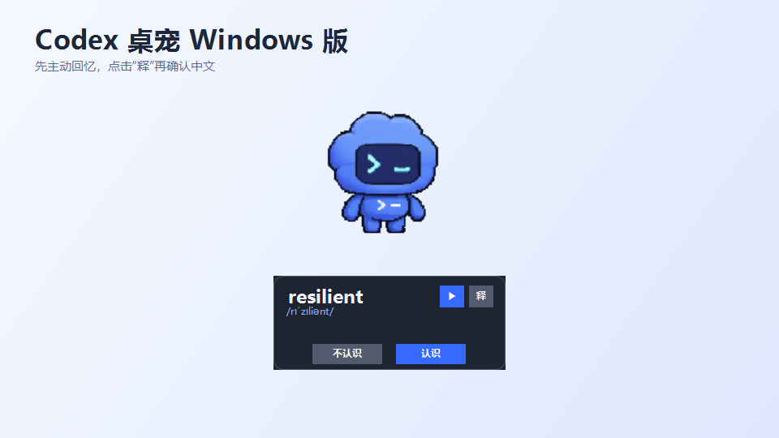
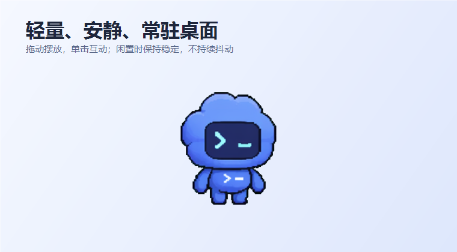
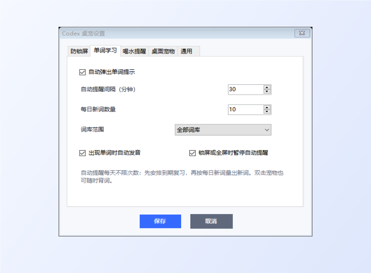

# Codex 桌宠 Windows 版

一个面向 Windows 桌面的轻量宠物，包含自动背单词、间隔复习、喝水提醒和可配置防锁屏功能。

> 非官方个人项目，与 OpenAI 没有隶属、授权或背书关系。Codex、OpenAI 及相关标识归其各自权利人所有。



## 功能

- Codex 风格桌面宠物，可拖动、单击互动和视线跟随
- 内置 Codex 蓝色与新增主题两套外观，可在托盘设置的“桌面宠物”页即时切换
- 宠物脚下的半透明单词气泡，默认隐藏释义，点击“释”后显示
- “认识 / 不认识”两种反馈和自适应间隔复习
- 默认每 30 分钟自动提醒，每日提醒次数不限
- 默认每日 10 个新词，到期复习词优先
- 锁屏或全屏应用期间暂停自动背词提醒
- 宠物脚下喝水提醒
- 设置、立即背词和退出功能集中在系统托盘
- 不安装全局键盘或鼠标钩子



## 设置

主题、宠物大小、单词数量、自动提醒间隔、词库、发音、全屏暂停以及喝水提醒都可以在系统托盘设置中调整。切换主题不会影响学习进度、喝水计时或防锁屏设置；主题资源异常时会自动回退到 Codex 蓝色。




## 下载

普通用户请前往仓库的 **Releases** 页面下载最新版压缩包，解压后运行 `Codex桌宠-v6.0.exe`。

系统要求：Windows 7、Windows 8、Windows 8.1、Windows 10 或 Windows 11，并安装 .NET Framework 4.0 或更高版本。

## 编译

在 Windows PowerShell 中运行：

```powershell
.\build-windows.ps1
```

脚本使用 .NET Framework 4.0 自带的 C# 编译器，不依赖 Visual Studio。

## 操作

- 单击宠物：挥手或跳跃
- 双击宠物：立即显示一个单词
- 单词卡“释”：显示或隐藏中文释义
- 拖动宠物：移动并保存位置
- 右击托盘图标：打开设置、立即背词、喝水提醒或退出

详细说明见 [使用说明.md](使用说明.md)。

## 数据与隐私

- 单词学习进度和设置保存在当前 Windows 用户的注册表 `Software\CodexPetWin7`。
- 程序离线运行，不上传学习记录。
- 异常日志保存在 `%LOCALAPPDATA%\CodexPetWin7\crash.log`。

## 词库与素材说明

`wordbooks.tsv` 是项目内置的离线整理词库，包含 IELTS 和日常高频分组。当前版本没有完整记录其原始资料链路，因此不将其声明为任何机构的官方词库。若用于再分发或商业用途，请自行复核其中释义、例句及素材的授权情况。

## 自适应复习

每个单词独立记录稳定度、难度、遗忘次数和复习时间。“认识且未查看释义”会获得更长间隔；查看释义后再点“认识”采用较保守的间隔；“不认识”则在约 10 分钟后重新学习。旧版学习记录会自动迁移。

如果没有提前查看释义，选择“认识”或“不认识”后会显示中文释义 4 秒，期间可以更正选择，最终按最后一次选择安排复习；已经手动查看过释义时则直接关闭。

`assets/` 中的角色图像用于本项目的非官方展示，不包含在 MIT 代码许可证的授权范围内。

新增主题中的人物肖像和参考图片不属于 MIT 许可证授权范围；公开再分发或商业使用前，请自行取得必要授权。

## 许可证

程序源代码采用 [MIT License](LICENSE)。第三方名称、标识、角色素材和词库内容不包含在该许可证中。
